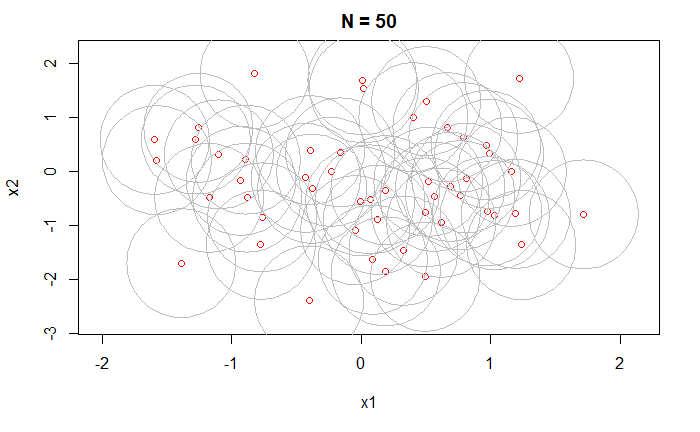
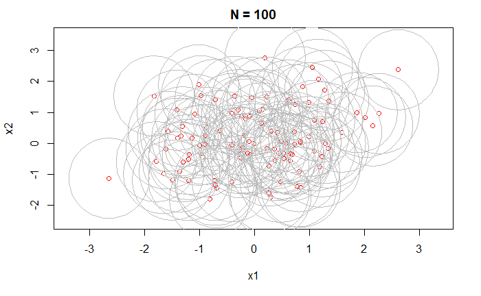
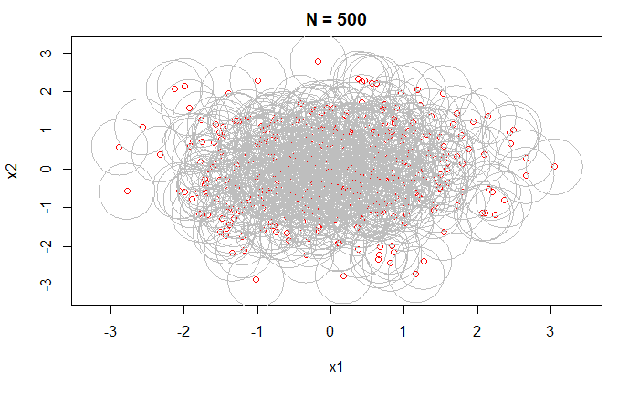

# SEND

### Installation
`SEND` stands for **S**et **E**stimation and **N**onparametric **D**etection. Since this package is written as an exercise / a side project, it is not published on CRAN. Download and unzip the folder and type
`install.package(path, repos = NULL, type = 'source')` in the R console.

### Introduction
This repository contains code to reproduce the results in Baíllo, A., Cuevas, A., & Justel, A. (2000). Set estimation theory involves estimating a set $S \subset \mathbb{R}^d$ from a set of randomly sampled data points $X_1,..., X_n \in S$. In this package `SEND`, `X` is the data matrix with each row $X_i$.

A simple estimator is provided by $$\hat{S}\_n = \bigcup\_{i=1}^n B(X_i, \epsilon_n)$$ where $B(x, \epsilon)$ is a closed ball centered at $x$ with radius $\epsilon$. In addition, $\epsilon_n \rightarrow 0$ as $n \rightarrow \infty$.

### Estimation 
The radius $\epsilon_n$ is estimated by Devroye-Wise nonparametric detection method. The false alarm probability $\alpha$ i.e. when $X_{n+1} \notin S_n(\bar{\epsilon}\_n)$, is given $$P(T_n > c_\alpha) = \alpha$$ where $T_n$ is a statistic calculated from $X_i$. Baíllo, A., Cuevas, A., & Justel, A. (2000) proposed two methods, smoothed bootstrap (SB) and cross-validation smoothing (CVS), to estimate the critical value $c_\alpha$. They are implemented under `sm.boot` and `cv.smooth` in `SEND`.

### Demo 1
Set estimation with different values of $n=50,100,500$,

### Reference
Baíllo, A., Cuevas, A., & Justel, A. (2000). Set Estimation and Nonparametric Detection. The Canadian Journal of Statistics / La Revue Canadienne de Statistique, 28(4), 765–782. https://doi.org/10.2307/3315915
